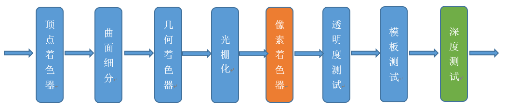

GPU 是显卡（Video card、Display card、Graphics card）最核心的部件。
但除了 GPU，显卡还有扇热器、通讯元件、与主板和显示器连接的各类插槽。

## History

GPU 自从上世纪 90 年代出现雏形以来，经过 20 多年的发展，已经发展成不仅仅是渲染图形这么简单，
还包含了数学计算、物理模拟、AI 运算等功能。(主要是因为对于数据密集任务的高效处理能力)

### NV GPU 架构发展

众所周知，CPU 的发展符合摩尔定律：每 18 个月速度翻倍。

NVIDIA 创始人黄仁勋在很多年前曾信誓旦旦地说，GPU 的速度和功能要超越摩尔定律，每 6 个月就翻一倍。
NV 的 GPU 发展史证明，他确实做到了！GPU 的提速幅率远超 CPU。

NVIDIA GPU 架构历经多次变革，从起初的 Tesla 发展到最新的 Turing 架构，发展史可分为以下时间节点：

- 2008 - Tesla

  Tesla 最初是给计算处理单元使用的，应用于早期的 CUDA 系列显卡芯片中，并不是真正意义上的普通图形处理芯片。

- 2010 - Fermi

  Fermi 是第一个完整的 GPU 计算架构。首款可支持与共享存储结合纯 cache 层次的 GPU 架构，支持 ECC 的 GPU 架构。

- 2012 - Kepler

  Kepler 相较于 Fermi 更快，效率更高，性能更好。

- 2014 - Maxwell

  其全新的立体像素全局光照 (VXGI) 技术首次让游戏 GPU 能够提供实时的动态全局光照效果。基于 Maxwell 架构的 GTX 980 和 970 GPU 采用了包括多帧采样抗锯齿 (MFAA)、动态超级分辨率 (DSR)、VR Direct 以及超节能设计在内的一系列新技术。

- 2016 - Pascal

  Pascal 架构将处理器和数据集成在同一个程序包内，以实现更高的计算效率。1080 系列、1060 系列基于 Pascal 架构

- 2017 - Volta

  Volta 配备 640 个 Tensor 核心，每秒可提供超过 100 兆次浮点运算(TFLOPS) 的深度学习效能，比前一代的 Pascal 架构快 5 倍以上。

- 2018 - Turing

  Turing 架构配备了名为 RT Core 的专用光线追踪处理器，能够以高达每秒 10 Giga Rays 的速度对光线和声音在 3D 环境中的传播进行加速计算。Turing 架构将实时光线追踪运算加速至上一代 NVIDIA Pascal™ 架构的 25 倍，并能以高出 CPU 30 多倍的速度进行电影效果的最终帧渲染。2060 系列、2080 系列显卡也是跳过了 Volta 直接选择了 Turing 架构。

### GPU 功能

现代 GPU 除了绘制图形外，还担当了很多额外的功能，综合起来如下几方面：

- 图形绘制。

  这是 GPU 最传统的拿手好戏，也是最基础、最核心的功能。为大多数 PC 桌面、移动设备、图形工作站提供图形处理和绘制功能。

- 物理模拟。

  GPU 硬件集成的物理引擎（PhysX、Havok），为游戏、电影、教育、科学模拟等领域提供了成百上千倍性能的物理模拟，使得以前需要长时间计算的物理模拟得以实时呈现。

- 海量计算。

  计算着色器及流输出的出现，为各种可以并行计算的海量需求得以实现，CUDA 就是最好的例证。

- AI 运算。

  近年来，人工智能的崛起推动了 GPU 集成了 AI Core 运算单元，反哺 AI 运算能力的提升，给各行各业带来了计算能力的提升。

- 其它计算。

  音视频编解码、加解密、科学计算、离线渲染等等都离不开现代 GPU 的并行计算能力和海量吞吐能力。

## 物理架构

由于纳米工艺的引入，GPU 可以将数以亿记的晶体管和电子器件集成在一个小小的芯片内。从宏观物理结构上看，现代大多数桌面级 GPU 的大小跟数枚硬币同等大小，部分甚至比一枚硬币还小（下图）。


当 GPU 结合散热风扇、PCI 插槽、HDMI 接口等部件之后，就组成了显卡。

显卡不能独立工作，需要装载在主板上，结合 CPU、内存、显存、显示器等硬件设备，组成完整的 PC 机。

GPU 的微观结构因不同厂商、不同架构都会有所差异，但核心部件、概念、以及运行机制大同小异。下面将展示部分架构的 GPU 微观物理结构。

### NV Tesla


Tesla 微观架构总览图如上。下面将阐述它的特性和概念：

- 拥有 7 组 TPC（Texture/Processor Cluster，纹理处理簇）
- 每个 TPC 有两组 SM（Stream Multiprocessor，流多处理器）每个 SM 包含：
  - 6 个 SP（Streaming Processor，流处理器）
  - 2 个 SFU（Special Function Unit，特殊函数单元）
  - L1 缓存、MT Issue（多线程指令获取）、C-Cache（常量缓存）、共享内存
- 除了 TPC 核心单元，还有与显存、CPU、系统内存交互的各种部件。

### NV Fermi


拥有 16 个 SM

- 每个 SM：
  - 2 个 Warp（线程束）
  - 两组共 32 个 Core
  - 16 组加载存储单元（LD/ST）
  - 4 个特殊函数单元（SFU）
- 每个 Warp：
  - 16 个 Core
  - Warp 编排器（Warp Scheduler）
  - 分发单元（Dispatch Unit）
- 每个 Core：
  - 1 个 FPU（浮点数单元）
  - 1 个 ALU（逻辑运算单元）

### NV Maxwell


采用了 Maxwell 的 GM204，拥有 4 个 GPC，每个 GPC 有 4 个 SM，对比 Tesla 架构来说，在处理单元上有了很大的提升

## NV Kepler


Kepler 除了在硬件有了提升，有了更多处理单元之外，还将 SM 升级到了 SMX。SMX 是改进的架构，支持动态创建渲染线程（下图），以降低延迟。


## NV Turing


上图是采纳了 Turing 架构的 TU102 GPU，它的特点如下：

- 6 GPC（图形处理簇）
- 36 TPC（纹理处理簇）
- 72 SM（流多处理器）
- 每个 GPC 有 6 个 TPC，每个 TPC 有 2 个 SM
- 4,608 CUDA 核
- 72 RT 核
- 576 Tensor 核
- 288 纹理单元
- 12x32 位 GDDR6 内存控制器 (共 384 位)

单个 SM 的结构图如下：


每个 SM 包含：

- 64 CUDA 核
- 8 Tensor 核
- 256 KB 寄存器文件

TU102 GPU 芯片实物图：


### GPU 架构共性

纵观上一节的所有 GPU 架构，可以发现它们虽然有所差异，但存在着很多相同的概念和部件：

- GPC
- TPC
- Thread
- SM、SMX、SMM
- Warp
- SP
- Core
- ALU
- FPU
- SFU
- ROP
- Load/Store Unit
- L1 Cache
- L2 Cache
- Memory
- Register File

以上各个部件的用途将在下一章详细阐述。

GPU 为什么会有这么多层级且有这么多雷同的部件？答案是 GPU 的任务是天然并行的，现代 GPU 的架构皆是以高度并行能力而设计的。

## GPU 运行机制

### 渲染总览

由上一章可得知，现代 GPU 有着相似的结构，有很多相同的部件，在运行机制上，也有很多共同点。下面是 Fermi 架构的运行机制总览图：


从 Fermi 开始 NVIDIA 使用类似的原理架构，使用一个 Giga Thread Engine 来管理所有正在进行的工作，GPU 被划分成多个 GPCs (Graphics Processing Cluster)，每个 GPC 拥有多个 SM（SMX、SMM）和一个光栅化引擎 (Raster Engine)，它们其中有很多的连接，最显著的是 Crossbar，它可以连接 GPCs 和其它功能性模块（例如 ROP 或其他子系统）。

程序员编写的 shader 是在 SM 上完成的。每个 SM 包含许多为线程执行数学运算的 Core （核心）。例如，一个线程可以是顶点或像素着色器调用。这些 Core 和其它单元由 Warp Scheduler 驱动，Warp Scheduler 管理一组 32 个线程作为 Warp （线程束）并将要执行的指令移交给 Dispatch Units。

GPU 中实际有多少这些单元（每个 GPC 有多少个 SM，多少个 GPC ...）取决于芯片配置本身。例如，GM204 有 4 个 GPC，每个 GPC 有 4 个 SM，但 Tegra X1 有 1 个 GPC 和 2 个 SM，它们均采用 Maxwell 设计。 SM 设计本身（内核数量，指令单位，调度程序 ...）也随着时间的推移而发生变化，并帮助使芯片变得如此高效，可以从高端台式机扩展到笔记本电脑移动。


如上图，对于某些 GPU（如 Fermi 部分型号）的单个 SM，包含：

- 32 个运算核心 （Core，也叫流处理器 Stream Processor）
- 16 个 LD/ST（load/store）模块来加载和存储数据
- 4 个 SFU（Special function units）执行特殊数学运算（sin、cos、log 等）
- 128KB 寄存器（Register File）
- 64KB L1 缓存
- 全局内存缓存（Uniform Cache）
- 纹理读取单元
- 纹理缓存（Texture Cache）
- PolyMorph Engine：多边形引擎负责属性装配（attribute Setup）、顶点拉取(VertexFetch)、曲面细分、栅格化（这个模块可以理解专门处理顶点相关的东西）。
- 2 个 Warp Schedulers：这个模块负责 warp 调度，一个 warp 由 32 个线程组成，warp 调度器的指令通过 Dispatch Units 送到 Core 执行。
- 指令缓存（Instruction Cache）
- 内部链接网络（Interconnect Network）

### GPU 运行逻辑

了解上一节的部件和概念之后，可以深入阐述 GPU 的渲染过程和步骤。下面将以 Fermi 家族的 SM 为例，进行逻辑管线的详细说明。


1. 程序通过图形 API(DX、GL、WEBGL)发出 drawcall 指令，指令会被推送到驱动程序，驱动会检查指令的合法性，然后会把指令放到 GPU 可以读取的 Pushbuffer 中。

2. 经过一段时间或者显式调用 flush 指令后，驱动程序把 Pushbuffer 的内容发送给 GPU，GPU 通过主机接口（Host Interface）接受这些命令，并通过前端（Front End）处理这些命令。

3. 在图元分配器(Primitive Distributor)中开始工作分配，处理 indexbuffer 中的顶点产生三角形分成批次(batches)，然后发送给多个 PGCs。这一步的理解就是提交上来 n 个三角形，分配给这几个 PGC 同时处理。


4. 在 GPC 中，每个 SM 中的 Poly Morph Engine 负责通过三角形索引(triangle indices)取出三角形的数据(vertex data)，即图中的 Vertex Fetch 模块。

5. 在获取数据之后，在 SM 中以 32 个线程为一组的线程束(Warp)来调度，来开始处理顶点数据。Warp 是典型的单指令多线程（SIMT，SIMD 单指令多数据的升级）的实现，也就是 32 个线程同时执行的指令是一模一样的，只是线程数据不一样，这样的好处就是一个 warp 只需要一个套逻辑对指令进行解码和执行就可以了，芯片可以做的更小更快，之所以可以这么做是由于 GPU 需要处理的任务是天然并行的。

6. SM 的 warp 调度器会按照顺序分发指令给整个 warp，单个 warp 中的线程会锁步(lock-step)执行各自的指令，如果线程碰到不激活执行的情况也会被遮掩(be masked out)。被遮掩的原因有很多，例如当前的指令是 if(true)的分支，但是当前线程的数据的条件是 false，或者循环的次数不一样（比如 for 循环次数 n 不是常量，或被 break 提前终止了但是别的还在走），因此在 shader 中的分支会显著增加时间消耗，在一个 warp 中的分支除非 32 个线程都走到 if 或者 else 里面，否则相当于所有的分支都走了一遍，线程不能独立执行指令而是以 warp 为单位，而这些 warp 之间才是独立的。

7. warp 中的指令可以被一次完成，也可能经过多次调度，例如通常 SM 中的 LD/ST(加载存取)单元数量明显少于基础数学操作单元。

8. 由于某些指令比其他指令需要更长的时间才能完成，特别是内存加载，warp 调度器可能会简单地切换到另一个没有内存等待的 warp，这是 GPU 如何克服内存读取延迟的关键，只是简单地切换活动线程组。为了使这种切换非常快，调度器管理的所有 warp 在寄存器文件中都有自己的寄存器。这里就会有个矛盾产生，shader 需要越多的寄存器，就会给 warp 留下越少的空间，就会产生越少的 warp，这时候在碰到内存延迟的时候就会只是等待，而没有可以运行的 warp 可以切换。


9. 一旦 warp 完成了 vertex-shader 的所有指令，运算结果会被 Viewport Transform 模块处理，三角形会被裁剪然后准备栅格化，GPU 会使用 L1 和 L2 缓存来进行 vertex-shader 和 pixel-shader 的数据通信。


10. 接下来这些三角形将被分割，再分配给多个 GPC，三角形的范围决定着它将被分配到哪个光栅引擎(raster engines)，每个 raster engines 覆盖了多个屏幕上的 tile，这等于把三角形的渲染分配到多个 tile 上面。也就是像素阶段就把按三角形划分变成了按显示的像素划分了。


11. SM 上的 Attribute Setup 保证了从 vertex-shader 来的数据经过插值后是 pixel-shade 是可读的。

12. GPC 上的光栅引擎(raster engines)在它接收到的三角形上工作，来负责这些这些三角形的像素信息的生成（同时会处理裁剪 Clipping、背面剔除和 Early-Z 剔除）。

13. 32 个像素线程将被分成一组，或者说 8 个 2x2 的像素块，这是在像素着色器上面的最小工作单元，在这个像素线程内，如果没有被三角形覆盖就会被遮掩，SM 中的 warp 调度器会管理像素着色器的任务。

14. 接下来的阶段就和 vertex-shader 中的逻辑步骤完全一样，但是变成了在像素着色器线程中执行。由于不耗费任何性能可以获取一个像素内的值，导致锁步执行非常便利，所有的线程可以保证所有的指令可以在同一点。


1.  最后一步，现在像素着色器已经完成了颜色的计算还有深度值的计算，在这个点上，我们必须考虑三角形的原始 api 顺序，然后才将数据移交给 ROP(render output unit，渲染输入单元)，一个 ROP 内部有很多 ROP 单元，在 ROP 单元中处理深度测试，和 framebuffer 的混合，深度和颜色的设置必须是原子操作，否则两个不同的三角形在同一个像素点就会有冲突和错误。

### GPU 技术要点

#### SIMD & SIMT

**SIMD**（Single Instruction Multiple Data）是单指令多数据，在 GPU 的 ALU 单元内，一条指令可以处理多维向量（一般是 4D）的数据。比如，有以下 shader 指令：

```c
float4 c = a + b; // a, b都是float4类型
```

对于没有 SIMD 的处理单元，需要 4 条指令将 4 个 float 数值相加，汇编伪代码如下：

```ass
ADD c.x, a.x, b.x
ADD c.y, a.y, b.y
ADD c.z, a.z, b.z
ADD c.w, a.w, b.w
```

但有了 SIMD 技术，只需一条指令即可处理完：

```ass
SIMD_ADD c, a, b
```


**SIMT**（Single Instruction Multiple Threads，单指令多线程）是 SIMD 的升级版，可对 GPU 中单个 SM 中的多个 Core 同时处理同一指令，并且每个 Core 存取的数据可以是不同的。

```ass
SIMT_ADD c, a, b
```

上述指令会被同时送入在单个 SM 中被编组的所有 Core 中，同时执行运算，但`a`、`b` 、`c`的值可以不一样：

> 这里应该指的是可以是不同类型


#### co-issue

**co-issue**是为了解决 SIMD 运算单元无法充分利用的问题。例如下图，由于 float 数量的不同，ALU 利用率从 100%依次下降为 75%、50%、25%。


为了解决着色器在低维向量的利用率低的问题，可以通过合并 1D 与 3D 或 2D 与 2D 的指令。例如下图，`DP3`指令用了 3D 数据，`ADD`指令只有 1D 数据，co-issue 会自动将它们合并，在同一个 ALU 只需一个指令周期即可执行完。


但是，对于向量运算单元（Vector ALU），如果其中一个变量既是操作数又是存储数的情况，无法启用 co-issue 技术：


于是**标量指令着色器**（Scalar Instruction Shader）应运而生，它可以有效地组合任何向量，开启 co-issue 技术，充分发挥 SIMD 的优势。

#### `if-else` 语句


如上图，SM 中有 8 个 ALU（Core），由于 SIMD 的特性，每个 ALU 的数据不一样，导致 `if-else` 语句在某些 ALU 中执行的是`true`分支（黄色），有些 ALU 执行的是`false`分支（灰蓝色），这样导致很多 ALU 的执行周期被浪费掉了（即 masked out），拉长了整个执行周期。最坏的情况，同一个 SM 中只有 1/8（8 是同一个 SM 的线程数，不同架构的 GPU 有所不同）的利用率。

同样，for 循环也会导致类似的情形，例如以下 shader 代码：

```c
void func(int count, int breakNum)
{
  for(int i=0; i<count; ++i)
  {
    if (i == breakNum)
      break;
    else
      // do something
  }
}
```

由于每个 ALU 的`count`不一样，加上有`break`分支，导致最快执行完 shader 的 ALU 可能是最慢的 N 分之一的时间，但由于 SIMD 的特性，最快的那个 ALU 依然要等待最慢的 ALU 执行完毕，才能接下一组指令的活！也就白白浪费了很多时间周期。

#### Early-Z

早期 GPU 的渲染管线的深度测试是在像素着色器之后才执行（下图），这样会造成很多本不可见的像素执行了耗性能的像素着色器计算。



后来，为了减少像素着色器的额外消耗，将深度测试提至像素着色器之前（下图），这就是 Early-Z 技术的由来。


Early-Z 技术可以将很多无效的像素提前剔除，避免它们进入耗时严重的像素着色器。Early-Z 剔除的最小单位不是 1 像素，而是像素块（pixel quad，2x2 个像素。

但是，以下情况会导致 Early-Z 失效：

开启 Alpha Test：由于 Alpha Test 需要在像素着色器后面的 Alpha Test 阶段比较，所以无法在像素着色器之前就决定该像素是否被剔除。

- 开启 Alpha Blend：启用了 Alpha 混合的像素很多需要与 frame buffer 做混合，无法执行深度测试，也就无法利用 Early-Z 技术。
- 开启 Tex Kill：即在 shader 代码中有像素摒弃指令（DX 的 discard，OpenGL 的 clip）。
- 关闭深度测试。Early-Z 是建立在深度测试看开启的条件下，如果关闭了深度测试，也就无法启用 Early-Z 技术。
- 开启 Multi-Sampling：多采样会影响周边像素，而 Early-Z 阶段无法得知周边像素是否被裁剪，故无法提前剔除。
- 以及其它任何导致需要混合后面颜色的操作。

此外，Early-Z 技术会导致一个问题：深度数据冲突（depth data hazard）。


例子要结合上图，假设数值深度值 5 已经经过 Early-Z 即将写入 Frame Buffer，而深度值 10 刚好处于 Early-Z 阶段，读取并对比当前缓存的深度值 15，结果就是 10 通过了 Early-Z 测试，会覆盖掉比自己小的深度值 5，最终 frame buffer 的深度值是错误的结果。

避免深度数据冲突的方法之一是在写入深度值之前，再次与 frame buffer 的值进行对比：


#### 统一着色器架构（Unified shader Architecture）

在早期的 GPU，顶点着色器和像素着色器的硬件结构是独立的，它们各有各的寄存器、运算单元等部件。这样很多时候，会造成顶点着色器与像素着色器之间任务的不平衡。对于顶点数量多的任务，像素着色器空闲状态多；对于像素多的任务，顶点着色器的空闲状态多（下图）。


于是，为了解决 VS 和 PS 之间的不平衡，引入了统一着色器架构（Unified shader Architecture）。用了此架构的 GPU，VS 和 PS 用的都是相同的 Core。也就是，同一个 Core 既可以是 VS 又可以是 PS。


这样就解决了不同类型着色器之间的不平衡问题，还可以减少 GPU 的硬件单元，压缩物理尺寸和耗电量。此外，VS、PS 可还可以和其它着色器（几何、曲面、计算）统一为一体。


#### 像素块（Pixel Quad）

上一节步骤 13 提到：

> 32 个像素线程将被分成一组，或者说 8 个 2x2 的像素块，这是在像素着色器上面的最小工作单元，在这个像素线程内，如果没有被三角形覆盖就会被遮掩，SM 中的 warp 调度器会管理像素着色器的任务。

也就是说，在像素着色器中，会将相邻的四个像素作为不可分隔的一组，送入同一个 SM 内 4 个不同的 Core。

> 为什么像素着色器处理的最小单元是 2x2 的像素块？
> 笔者推测有以下原因：
>
> 1. 简化和加速像素分派的工作。
> 2. 精简 SM 的架构，减少硬件单元数量和尺寸。
> 3. 降低功耗，提高效能比。
> 4. 无效像素虽然不会被存储结果，但可辅助有效像素求导函数。详见 4.6 利用扩展例证。

这种设计虽然有其优势，但同时，也会激化过绘制（Over Draw）的情况，损耗额外的性能。比如下图中，白色的三角形只占用了 3 个像素（绿色），按我们普通的思维，只需要 3 个 Core 绘制 3 次就可以了。


但是，由于上面的 3 个像素分别占据了不同的像素块（橙色分隔），实际上需要占用 12 个 Core 绘制 12 次（下图）。


这就会额外消耗 300%的硬件性能，导致了更加严重的过绘制情况。

更多详情可以观看虚幻官方的视频教学：实时渲染深入探究。

## Reference

https://www.cnblogs.com/timlly/p/11471507.html
